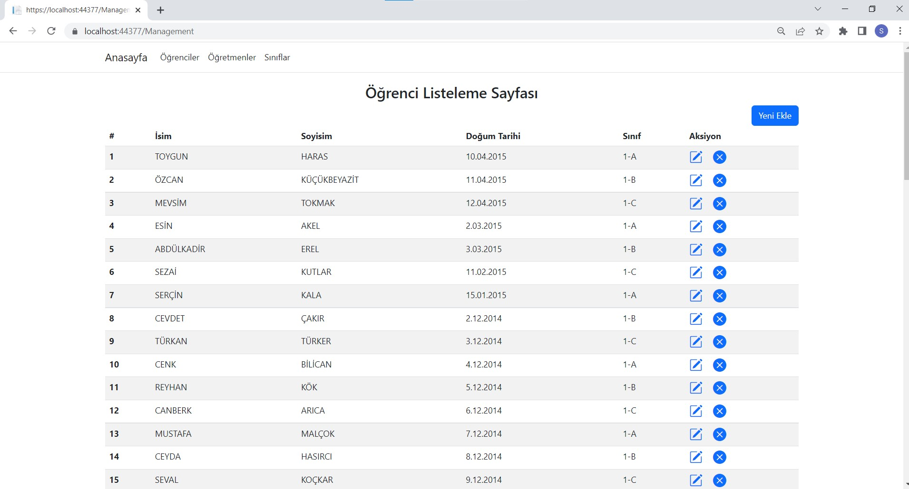
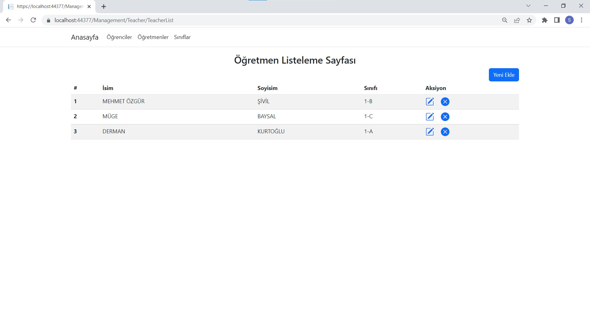
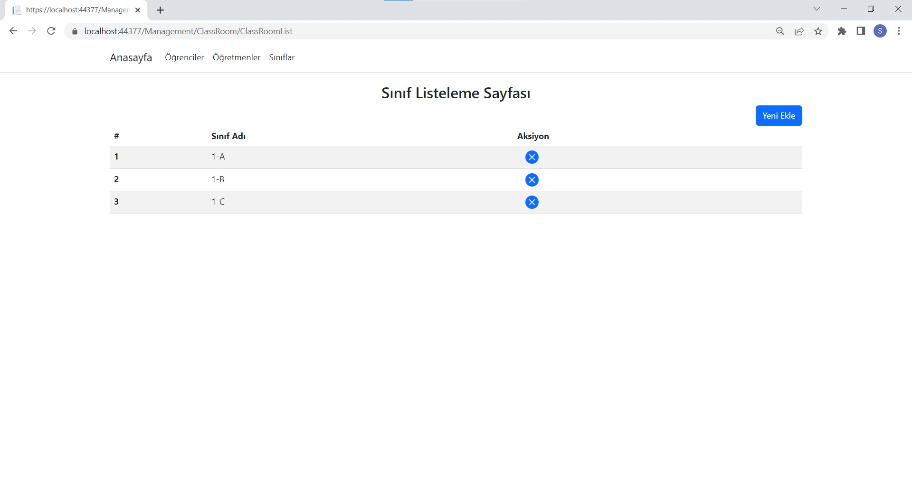

# Teklas - CaseStudy - Serkan Özdemir

Bu projede gönderilen excel dosyası içindeki datalar MSSQL Database'ine aktarılmış, bu datalar üzerinde listeleme, oluşturma, değiştirme ve silme işlemleri gerçekleştirilmiştir. 

## Data Hazırlama

Proje açıldıktan sonra add-migration ve update-migration komutları çalıştırılarak veritabanı oluşturulmalıdır. Daha sonra MSSQL arayüzü üzerinden Data Import ile excelde bulunan datalar mevcut database'e data mapping kullanılarak aktarılmıştır.

## Sayfalar

Öğrenciler, öğretmenler ve sınıflar olmak üzere navbar'da 3 adet seçenek bulunmaktadır.

### Öğrenciler:

Öğrenci listeleme, yeni öğrenci ekleme, mevcut öğrenciyi düzenleme ve silme aksiyonları bu sayfa altındadır.

### Öğretmenler:

Öğretmen listeleme, yeni öğretmen ekleme, mevcut öğretmeni düzenleme ve silme aksiyonları bu sayfa altındadır. Yeni öğretmen eklerken sınıf seçimi zorunlu değildir. Ancak her sınıfın tek bir öğretmeni olacağı için bir öğretmene sınıf eklerken daha önceden bu sınıfa bir öğretmen atanıp atanmadığı kontrolü yapılmaktadır.

### Sınıflar:

Sınıf listeleme, yeni sınıf ekleme ve silme aksiyonları bu sayfa altındadır. Sınıf isimleri tektir. Aynı isimle bir sınıf daha eklenemez. 

